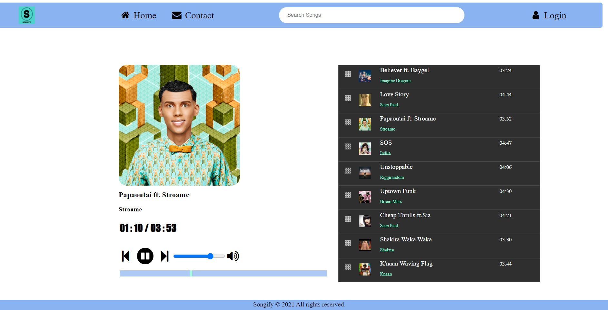

# Songify MP3 Player

An elegant MP3 Player using HTML, CSS and Java Script. 

## Functionalities

- Song playlist will be auto generated.
- Play / Pause the Song.
- Control the volume of the song.
- Sort the index of the song by sliding the playlist.

## Authors

- [@ashokcs](https://www.github.com/ashokcs)

## Demo

## Deployment

To deploy this project run

Go to Github.com/ashokcs -> Settings -> Pages -> Select Branch ->Save

